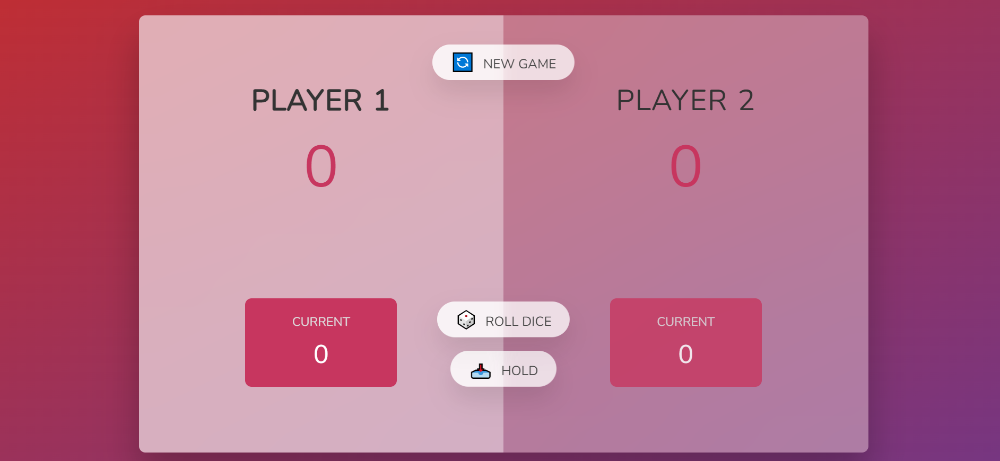

# Pig Game

This is a litlle pig game created with JavaScript. Have Fun!

## Table of contents

- [Logic of the game](#logicOfTheGame)
  - [The game](#the-game)
  - [Screenshot](#screenshot)
  - [Built with](#built-with)
- [Author](#author)

## Logic of the game

It is a 2 player game. The backgorund color indicates which server the game queue is on. The player rolls the dice. The numbers on the dice are added together until the number 1 comes up and that would be the current number.
When the number 1 comes, the current number is reset, so you can keep it whenever you want.Thus, the order of play changes. You can start a new game when you want.

### The game

Users should be able to:

- View the optimal layout depending on their device's screen size
- Roll the dice and get a random numbers
- Click the new game button and reset all the values

### Screenshot

### Built with

- Semantic HTML5 markup
- CSS custom properties
- Flexbox
- CSS Grid
- JavaScript

## Author

- Website - [Damla Kara](https://www.linkedin.com/in/damla-kara-348081232/)
